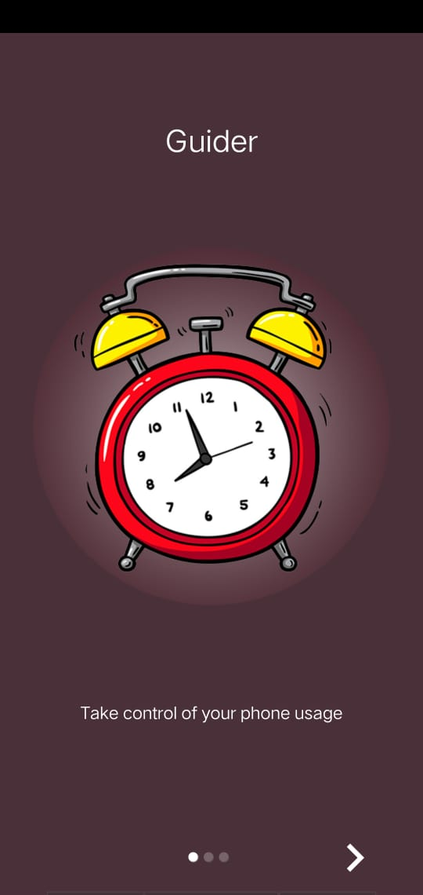
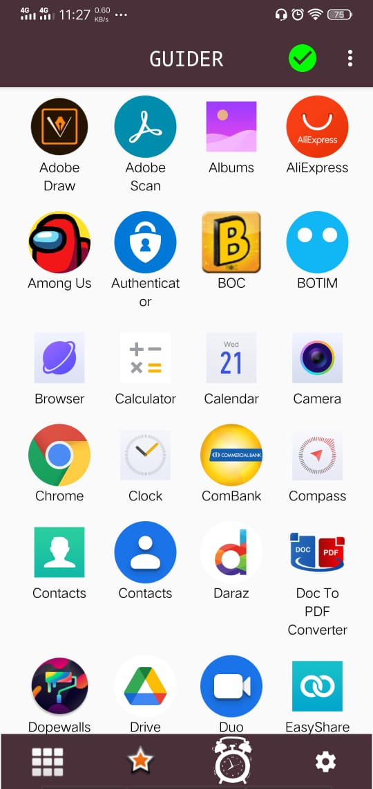
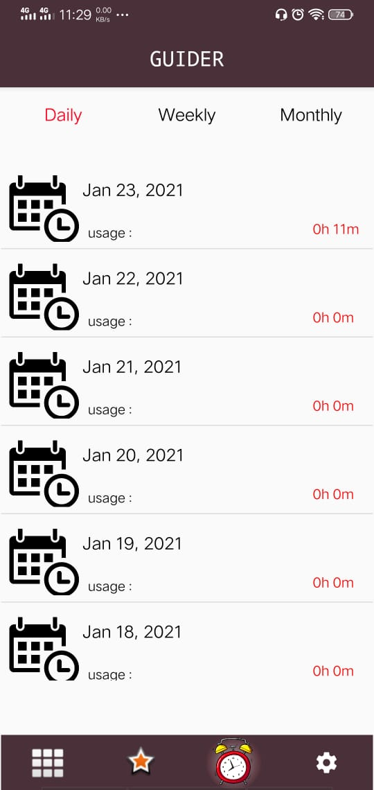
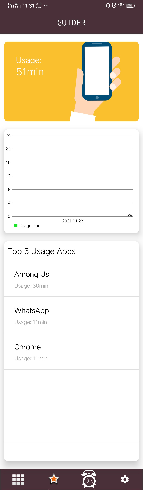
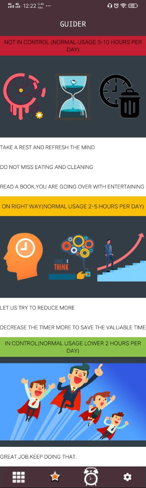
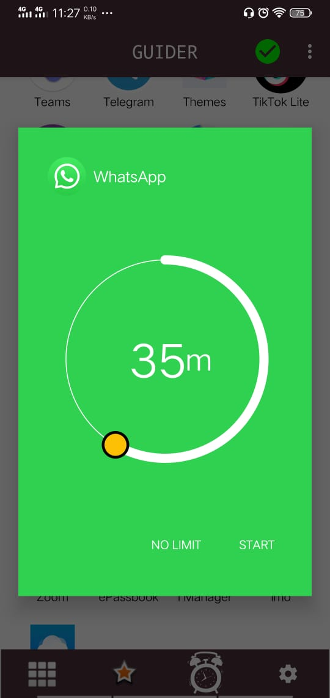
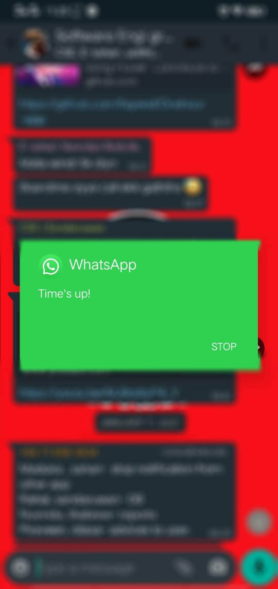

### **Guider mobile app:**

“Guider” app is a screen usage measuring app which you can control your android phone usage.
Take control of the time spent on other apps on Android guider helps you in managing the time you spend on your phone by setting time limits on applications.

### **Why Use Guider:**

Guider is the app you need if you ever find yourself

- Wasting too much time on social media/games/other apps when you have more important things to do 
- Endlessly scrolling your infinite social feeds.
- Hating yourself for procrastinating on important tasks but not able to exit apps and leave your phone aside to focus on your work 
- Wanting to check social feeds but don't want to end up spending all your time on them.

"Time is what we want most, but what we use worst." -William Penn

Use your time wisely.

### **Features:**

- Helps in Time Management 
- Simple and Minimal UI inspired by Material Design  
- Usage reports 
- Top 5 usage apps 
- Preferences for default time limit duration etc. 
- Small App Size: 6.74MB 
- No Ads: Absolutely Free to Use 
- Open Source: You can help it grow

### **How it Works:**

- Guider displays a list of all the apps on your phone.You can launch apps from this list itself by selecting with a time limit you want. 
- When the time limit is reached and your app is still being used (usage permission required), a dialog pops up notifying you of the same. From here you can either close the app. 

### **Permissions Required:**

- App Usage Stats: Permission to access your app usage stats is required in order to determine whether the launched app is being used at the end of the time limit.
No data is saved and this permission is only used at the end of time limit. 

### **Screenshots:**

    
  
 

